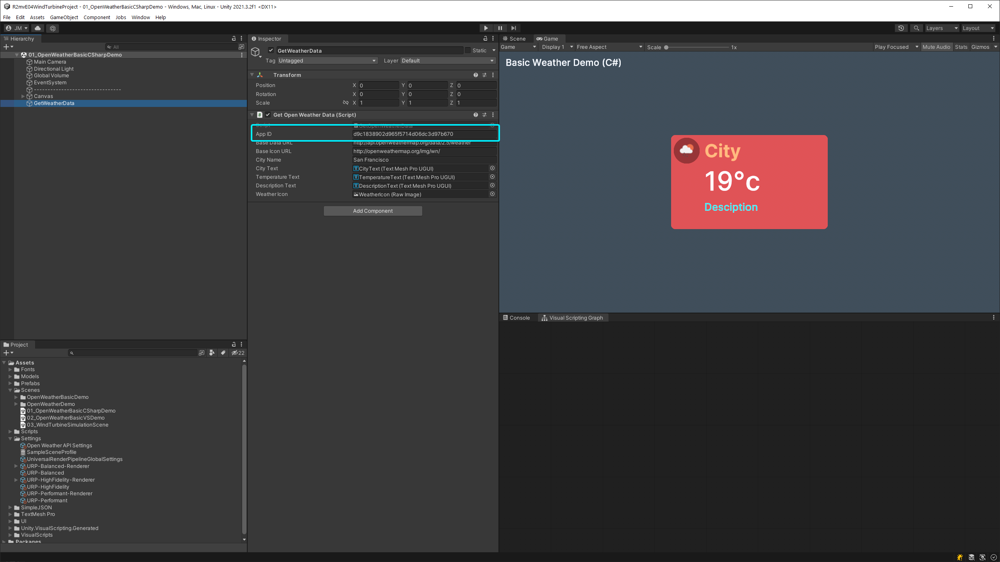
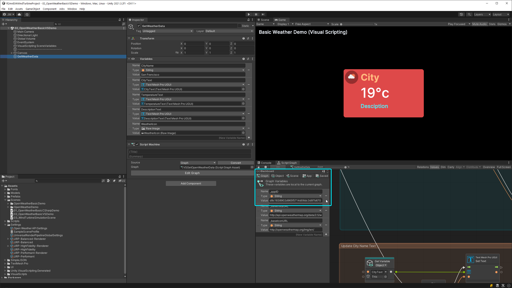
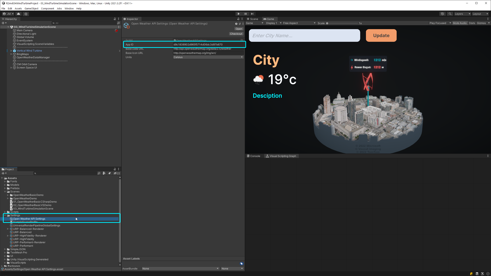
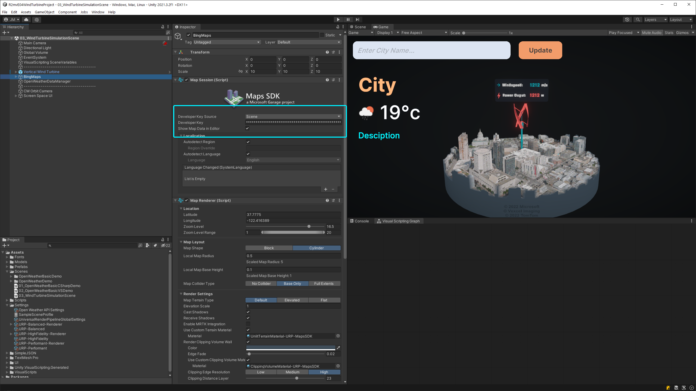

# Episode 04 - Wind Turbine Simulation

This example project is part of the [Road to Metaverse, Creator Series](https://create.unity.com/road-to-metaverse). For more information on episode 4: `How to bring your real-time 3D digital twin data into Unity`, check out [this forum thread](https://forum.unity.com/threads/workshops-how-to-bring-your-real-time-3d-digital-twin-data-into-unity.1293375/).

Assets & resources used: 
- [Open Weather API v2.5](https://openweathermap.org/current)
- [Microsoft Map SDK](https://github.com/microsoft/MapsSDK-Unity)
- [Vertical Turbine with Solar Panels](https://grabcad.com/library/vertical-turbine-with-solar-panels-1) by Rifky Zaidani
- [SimpleJSON](https://github.com/Bunny83/SimpleJSON/blob/master/SimpleJSONUnity.cs)

 

---

 

## ❓ What's included
There are **three scenes** in this project: 
- `01_OpenWeatherBasicCSharpDemo` shows how to retrieve weather data and update a simple widget using a **C# script**.
- `02_OpenWeatherBasicVSDemo` show how to retrieve weather data and update a simple widget using **Visual Scripting**.
- `03_WindTurbineSimulationScene` is the main demo for episode 4. You can **preview** the results on Furioos [here](https://portal.furioos.com/share/ruv4brroQKqNW8HS4).

 

---

 

## 🚨 Setup

 

### OpenWeather
Before you can pull weather data from the OpenWeather API, you will need to [create an account](https://home.openweathermap.org/users/sign_up) and generate an App Key.

 
View scene instructions, click to expand

> ### `01_OpenWeatherBasicCSharpDemo` setup 
> ### `02_OpenWeatherBasicVSDemo` setup 
> ### `03_WindTurbineSimulationScene` setup 

 

### Bing Maps   
To use the Microsoft Maps API you must first create an account in the [Bing Maps Dev Center](https://www.bingmapsportal.com/) and generate a new key. Instructions to get started can be found [here](https://github.com/microsoft/MapsSDK-Unity/wiki/Getting-Started).

 
View scene instructions, click to expand

 > ### `03_WindTurbineSimulationScene` setup 

 

---

 

## ⚠️ Warning
> This is an **experimental** project **not** officially supported by Unity. Use at your own risk!
